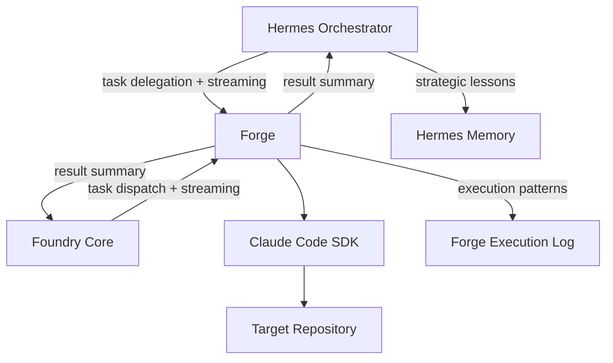

# **Hermes-Forge Orchestration**

**System Overview:** A distributed multi-agent system where a remote Hermes Agent acts as the primary orchestrator, delegating complex coding tasks and "Ralph loops" to Forge — a standalone Node.js service wrapping the Claude Code SDK — via a streaming HTTP API.

## **1\. Glossary of Terms**

* **Hermes Orchestrator:** The remote agent responsible for routing, strategic memory management, lesson derivation, and triggering tasks.
* **Forge:** The standalone Node.js/TypeScript service that wraps the Claude Code SDK and exposes an HTTP API for task execution with streaming output. Maintains its own execution memory (tool patterns, success/failure rates).
* **Claude Worker:** The headless execution of the Anthropic Claude Code SDK, instantiated by Forge per task.
* **Foundry Core:** The Go-based orchestrator backend (repository: `foundry-core`) that handles elicitation, task state management, and Forge dispatch. An alternative caller of Forge alongside Hermes.
* **Ralph Loop:** A designated iterative execution, reasoning, or validation loop triggered by the orchestrator.
* **Execution Loop:** A single cycle of Claude Code proposing an action, executing a tool, and evaluating the result.

## **2\. System Context**

Forge is a shared execution service called by multiple orchestrators:

### **Memory Architecture (Separated)**

Each component owns its own memory domain. Components share outcomes via API responses, not raw memory state.

* **Hermes:** Strategic lessons, routing decisions, user preferences. Stored in Hermes profiles and skill database.
* **Forge:** Execution patterns, tool success rates, error frequencies. Stored as local structured logs.
* **Foundry Core:** Session state, artifacts, task history. Stored in SQLite.

---

## **3\. Forge API & Streaming Requirements**

**REQ-API-01 (Ubiquitous)**

**The** Forge service **shall** expose a network-accessible HTTP endpoint (`POST /tasks`) to accept task delegation payloads from the Hermes Orchestrator or Foundry Core.

**REQ-API-02 (Event-Driven)**

**When** Forge receives a valid task payload, **Forge shall** instantiate a headless session of the Claude Code SDK with the specified tool constraints and context boundaries.

**REQ-API-03 (State-Driven)**

**While** the Claude Worker is executing a task, **Forge shall** stream real-time execution events (including tool calls, standard output, standard error, and progress metadata) back to the caller via Server-Sent Events (SSE).

**REQ-API-04 (Unwanted Behavior)**

**If** the connection between the caller and Forge drops during execution, **Forge shall** continue executing the Claude Worker task and buffer the output for retrieval via `GET /tasks/{id}/output`.

**REQ-API-05 (Ubiquitous)**

**Forge shall** maintain a local execution log recording tool call patterns, success/failure rates, and error frequencies to inform its own operational behavior.

---

## **4\. Hermes Memory & Lesson Derivation Requirements**

**REQ-MEM-01 (State-Driven)**

**While** receiving a streaming response from Forge, **the** Hermes Orchestrator **shall** record the sequence of Claude Worker execution loops into its active memory system.

**REQ-MEM-02 (Event-Driven)**

**When** an execution event stream contains an error or a tool-call failure, **the** Hermes Orchestrator **shall** flag the specific loop within its memory for secondary analysis.

**REQ-MEM-03 (Event-Driven)**

**When** Forge signals the completion of a task, **the** Hermes Orchestrator **shall** analyze the recorded execution loops to derive actionable lessons.

**REQ-MEM-04 (Ubiquitous)**

**The** Hermes Orchestrator **shall** store derived lessons in its long-term memory system to influence future task delegation and prompt generation.

**REQ-MEM-05 (Boundary)**

**The** Hermes Orchestrator **shall not** access or depend on Forge's internal execution memory. Lesson derivation operates solely on the streamed execution events and result summaries provided by Forge's API.

---

## **5\. Ralph Loop Integration Requirements**

**REQ-RLP-01 (Feature/Optional)**

**Where** a task is classified by the Hermes Orchestrator as requiring a Ralph loop, **the** Hermes Orchestrator **shall** include the specific Ralph loop parameters in the payload sent to Forge.

**REQ-RLP-02 (Event-Driven)**

**When** Forge receives a payload containing Ralph loop parameters, **Forge shall** configure the Claude Worker's SDK options (such as allowed tools and context boundaries) to support that specific loop.

**REQ-RLP-03 (State-Driven)**

**While** executing a Ralph loop, **the** Hermes Orchestrator **shall** have the ability to inject updated context or halting commands into the active Forge execution stream.
